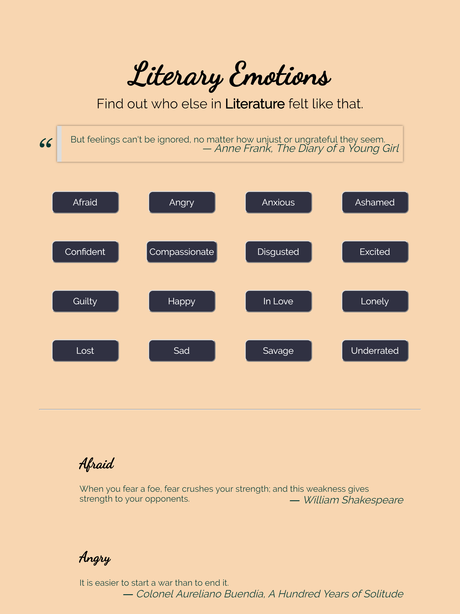

# Literary Emotions
## Description
An app that presents a group of emotion names displayed in a grid that reference links to literary fragments expressed by characters from some of my favourite books. Responsive design.

A top button will appear when the page is scrolled down. This allows the user to go back to the grid and select another emotion.

